# 基於 FreeSurfer 腦結構量化特徵與臨床資料之失智症分類研究

**Dementia Classification Using FreeSurfer-Derived Brain Structural Quantitative Features and Clinical Data**  
*Feature Selection, Multi-Model Comparison, and Ensemble Learning*

> 國立中山大學應用數學系碩士論文之 GitHub portfolio 版本。  
> Repository 主要整理**研究流程、方法設計、關鍵圖表與彙整結果**；受試者層級臨床資料、MRI 影像及 FreeSurfer 個別輸出不公開。

---

## 專案概述

失智症與輕度認知障礙的臨床評估通常結合認知量表、病史與功能狀態；結構式 MRI 則能提供臨床量表較難直接呈現的腦部形態資訊。

資料包含高雄榮民總醫院提供的 **3D T1-weighted MRI** 與臨床評估資料。MRI 經 **FreeSurfer 7.4.1** 處理後，萃取腦區體積、皮質厚度與表面積等腦結構量化特徵，並與臨床資訊共同建立失智症與認知異常分類流程。

分析重點不僅是比較分類模型的最佳分數，而是系統性觀察：

- 不同認知狀態分類任務的難度與特徵差異
- 不同 FreeSurfer 腦區組合的判別能力
- 特徵數量與模型複雜度對結果的影響
- eTIV 校正、機率校準與決策閾值所造成的差異
- 多模型集成是否能形成互補
- 臨床與影像資料在 early、intermediate 與 late fusion 下的表現
- FreeSurfer 結構影像在完整臨床資訊之外的增量價值

整體形成一套由**影像特徵篩選、模型比較、特徵選擇、機率品質、操作點、集成學習、多模態融合到敏感度分析**的完整機器學習評估流程。

### 分析規模

- 最終納入 **378 位受試者**：Dementia 85、MCI 233、Normal 60
- 建立 **3 項二元分類任務**
- 正式分析採用 **20 random seeds × 5-fold stratified cross-validation**
- FreeSurfer 初始整理 **9 個特徵群組、1,131 個量化特徵**
- 清理後母表包含 **397 個影像特徵與 33 個臨床特徵**
- 前期比較 **49 個不重複 FreeSurfer 影像方向**
- 各分析階段共涵蓋 **13 種分類模型**
- 後續延伸至 probability calibration、threshold optimization、ensemble learning 與三種 multimodal fusion strategy

---

## 1. 資料與分類任務

最終資料包含 Dementia、MCI 與 Normal 三類受試者。臨床資料涵蓋人口學資訊、生活型態、身體功能、健康狀態，以及 MMSE、CASI 等認知功能量表。

原始臨床資料除 ID 與標籤外共有 35 個欄位；移除收案日期與可能造成 label leakage 的 CDR score 後，保留 **33 個正式臨床預測特徵**。

| 類別 | 人數 | 比例 |
|---|---:|---:|
| Dementia | 85 | 22.5% |
| MCI | 233 | 61.6% |
| Normal | 60 | 15.9% |
| **合計** | **378** | **100%** |

三項二元分類任務分別對應不同程度的認知狀態分界：

| 任務 | 分類目標 | 正類 | 負類 | 樣本數 |
|---|---|---|---|---:|
| Task 1 | Dementia vs. NonDementia | Dementia (85) | MCI + Normal (293) | 378 |
| Task 2 | AbNormal vs. Normal | Dementia + MCI (318) | Normal (60) | 378 |
| Task 3 | MCI vs. Normal | MCI (233) | Normal (60) | 293 |

這三項任務除了比較模型效能，也能觀察模型在**失智症辨識、認知異常篩檢，以及較早期 MCI 辨識**上的差異。

---

## 2. FreeSurfer 腦結構量化特徵

3D T1 MRI 先以 `recon-all -all` 完成標準 FreeSurfer 結構處理，再以 `segmentHA_T1.sh` 取得海馬亞區與杏仁核子核的細部量測。

15 個 FreeSurfer 統計檔整理為 9 個特徵群組，共得到 **1,131 個初始量化特徵**：

| 群組 | 特徵數 | 主要資訊 |
|---|---:|---|
| brainvol | 16 | 全腦體積摘要 |
| aseg | 46 | 皮質下結構與腦室體積，含 eTIV |
| wmparc | 70 | 白質分區體積 |
| hippo | 44 | 海馬亞區體積 |
| amyg | 20 | 杏仁核子核體積 |
| aparc | 208 | Desikan–Killiany 皮質分區 |
| a2009s | 448 | Destrieux 皮質分區 |
| dkt | 193 | DKT 皮質分區 |
| ba_thresh | 86 | Brodmann area 相關分區 |

經樣本、常數、高頻率值與完全重複特徵清理後，正式母表保留：

- **378 位受試者**
- **397 個 FreeSurfer 特徵**
- **33 個臨床特徵**

缺失值填補、標準化與類別編碼等需要由資料估計的前處理參數，均僅使用各外層訓練資料建立，再套用至測試資料，以降低 data leakage。

---

## 3. 驗證設計與模型

正式模型評估採 **20 個隨機種子 × 5-fold stratified cross-validation**。

同一任務下的不同資料方向沿用相同外層切分，使模型與資料方向能在相同受試者組成下進行比較。需要超參數選擇的模型，在每個外層訓練折內再進行 **3-fold stratified inner cross-validation**。

同一 random seed 的 5 個外層測試折合併後形成完整 **out-of-fold prediction (OOF)**，後續的機率校準、閾值調整與集成分析皆建立在 OOF 預測之上。

### 模型範圍

共涵蓋 13 種基礎分類模型：

- **線性模型**：Logistic Regression、ElasticNet Logistic Regression、RidgeClassifier、LinearSVC
- **樹與梯度提升模型**：RandomForest、ExtraTrees、XGBoost、LightGBM、CatBoost
- **核與距離方法**：RBF-SVC、kNN
- **機率生成模型**：Gaussian Naive Bayes
- **表格式基礎模型**：TabPFN

主要評估指標包含：

- Balanced Accuracy
- ROC-AUC
- Sensitivity
- Specificity
- Brier score
- Expected Calibration Error (ECE)

影像增量比較另搭配 Wilcoxon signed-rank test 與 BH-FDR，用於觀察重複資料切分下 AUC 差異方向的一致程度。

---

## 4. 整體分析流程

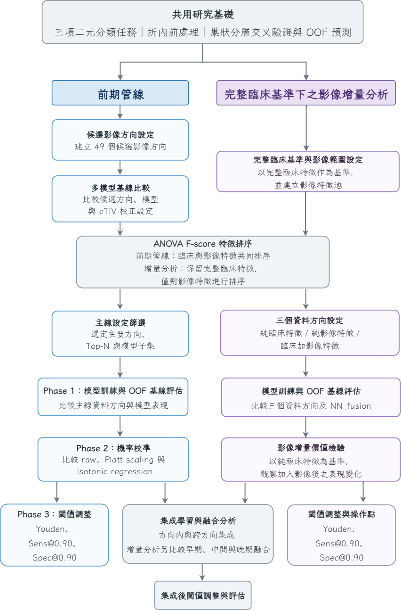

整體流程分為兩條主線：

### 前期分析管線

**影像方向篩選 → eTIV 校正比較 → 多模型基線 → ANOVA F-score 特徵排序 → Top-N 特徵數選擇 → Phase 1–4**

主要用來逐步縮小影像方向、模型與特徵集合，並進一步比較機率校準、操作閾值與集成方式。

### 完整臨床基準下的影像增量分析

保留完整 **Clin33**，另對 FreeSurfer 特徵獨立排序形成 **FS_topK**，再建立：

- Clin33
- FS_topK
- Clin33_FS_topK
- NN_fusion
- Late fusion

藉此比較純臨床、純影像與不同模態融合層級的表現。

---

# 主要分析結果

## 5. FreeSurfer 影像方向篩選

前期固定使用 ElasticNet Logistic Regression，比較：

- 9 個單一 FreeSurfer 群組
- 10 個具醫學意義的組合
- 30 個延伸組合

共 **49 個不重複影像方向**。

不同任務呈現不同的優勢結構：

- **Task 1**：皮質分區、皮質下結構與內側顳葉資訊的整合較具優勢
- **Task 2**：HIPPO 與 ASEG 等內側顳葉／皮質下結構較突出
- **Task 3**：判別訊號同樣較集中於 HIPPO，加入更廣泛的影像群組未持續改善結果

最後保留下列主要方向進入後續分析：

| 任務 | 主要方向 | 正式 Top-N |
|---|---|---:|
| Task 1 | APARC_ASEG_AMYG | Top-80 |
| Task 1 | APARC_ASEG_HIPPO | Top-80 |
| Task 2 | HIPPO_ASEG | Top-30 |
| Task 3 | HIPPO | Top-20 |

代表方向的多模型全特徵比較如下：

<details>
<summary><strong>展開：三項任務之多模型基線圖</strong></summary>

### Task 1 — APARC_ASEG_AMYG

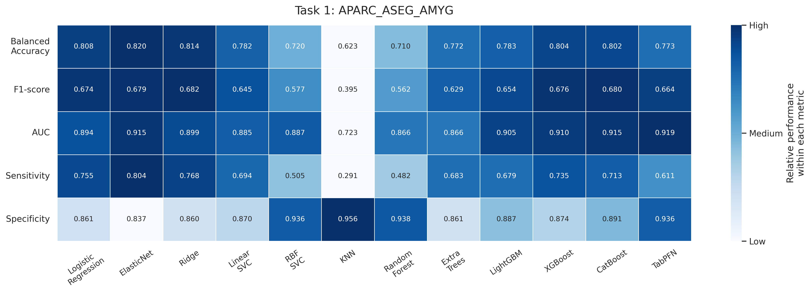

### Task 2 — HIPPO_ASEG

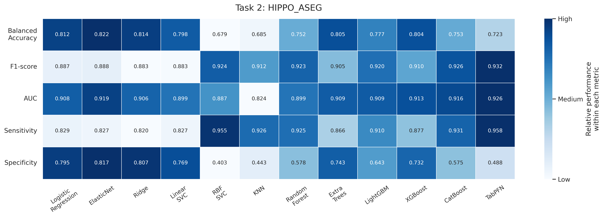

### Task 3 — HIPPO

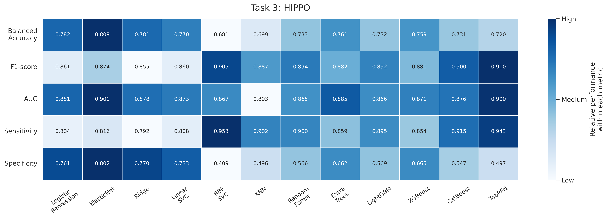

</details>

### 結果觀察

ElasticNet Logistic Regression 在三項代表方向皆呈現較高且穩定的 Balanced Accuracy；其他線性模型也較常維持 Sensitivity 與 Specificity 的平衡。

TabPFN 則多取得最高或接近最高的 AUC，並呈現較佳的 Brier score，但在固定操作點下的 Balanced Accuracy 不一定同步最高。

另外，Task 3 的整體表現低於 Task 1 與 Task 2，顯示 **MCI 與 Normal 的區分相對困難**。這也說明不同分類任務即使使用相同流程，適合的影像方向、模型特性與決策設定仍可能不同。

---

## 6. eTIV 校正

腦區體積可能受到個體顱內總體積影響，因此先檢驗 FreeSurfer 體積特徵與 **estimated total intracranial volume (eTIV)** 的關係。

256 個候選體積特徵中，共有 **201 個（78.5%）**在 BH-FDR 校正後仍與 eTIV 呈顯著線性關聯。

接著以折內殘差校正建立：

- **No_Adj**：未校正
- **Adj**：eTIV 校正

並在相同資料切分與模型設定下比較。

### 結果觀察

雖然多數體積特徵與 eTIV 存在明顯的統計關聯，校正後卻沒有形成一致的 Balanced Accuracy 或 AUC 改善：

- Task 1：整體大致持平
- Task 2 / Task 3：多數方向略為下降

因此後續主要分析採用 **No_Adj**。

這項結果也提供一個方法上的觀察：

> **統計上與 eTIV 顯著相關，不代表移除該變異後一定能提升分類效能。**

---

## 7. 特徵排序與 Top-N 選擇

主要方向確定後，以 **ANOVA F-score** 對臨床與影像特徵共同排序，再使用 ElasticNet Logistic Regression 與 RidgeClassifier 掃描不同 Top-N 特徵集合。

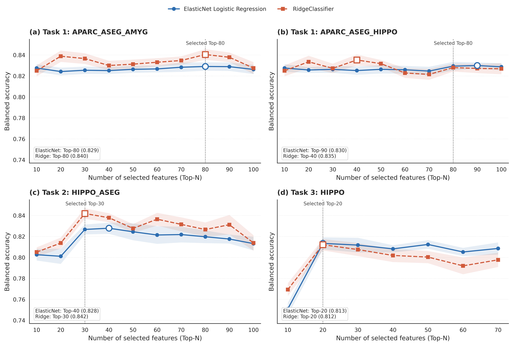

最後採用：

- Task 1：**Top-80**
- Task 2：**Top-30**
- Task 3：**Top-20**

整體沒有呈現「納入越多特徵，表現就越好」的趨勢。

### 特徵分布

排序前段主要由 MMSE、CASI 等認知量表構成；FreeSurfer 影像特徵則集中在具有神經解剖意義的區域。

Task 1 的代表性影像特徵包括：

- 左側楔前葉
- 左側海馬
- 中顳回
- 下顳回
- 杏仁核子核

Task 2 / Task 3 則較集中於：

- Whole hippocampus
- hippocampal body / head
- GC-ML-DG
- molecular layer
- CA3 等海馬亞區

因此，影像資訊除了提供分類訊號，也能補充臨床量表以外的神經解剖層面解釋。

<details>
<summary><strong>展開：Top-N AUC 補充結果</strong></summary>

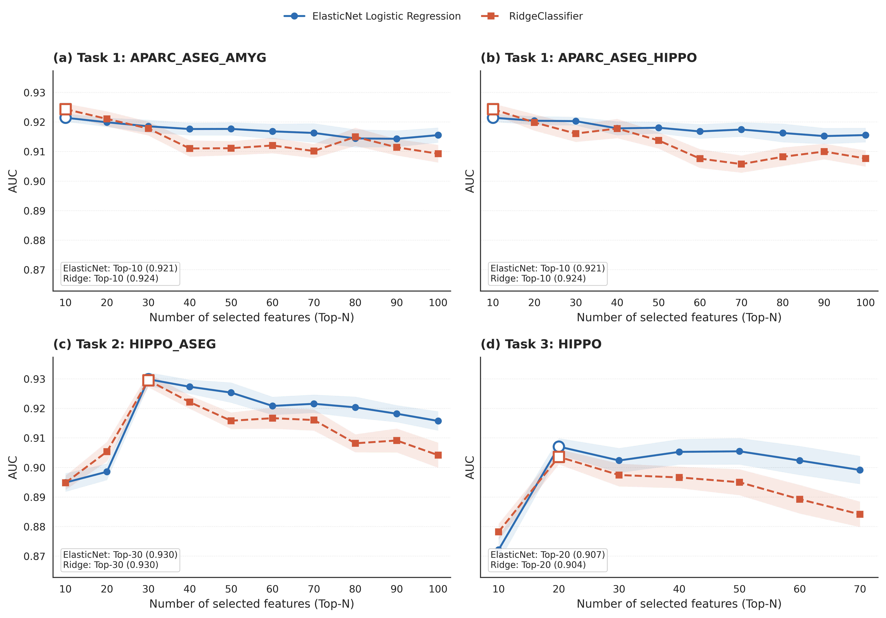

</details>

---

## 8. Phase 1：正式基線比較

完成影像方向、模型與特徵數篩選後，以 OOF 預測比較臨床加影像方向與純臨床方向。

| 任務 | 純臨床最高 BalAcc | 純臨床最高 AUC | 最佳 clin_fs BalAcc | 最佳 clin_fs AUC |
|---|---|---|---|---|
| Task 1 | RidgeClassifier **0.848** | TabPFN **0.928** | LinearSVC 0.841 | TabPFN 0.919 |
| Task 2 | RidgeClassifier **0.853** | TabPFN **0.932** | RidgeClassifier 0.839 | TabPFN 0.932 |
| Task 3 | RidgeClassifier **0.810** | TabPFN **0.905** | ElasticNet Logistic 0.808 | TabPFN 0.903 |

### 結果觀察

Task 1 與 Task 2 中，純臨床方向的整體表現較穩定；Task 3 的 clin_fs 在部分模型或指標上可接近純臨床結果，但沒有形成跨模型一致的影像增益。

不同模型也呈現不同特性：

- **線性模型**：Balanced Accuracy 及 Sensitivity / Specificity 平衡較穩定
- **TabPFN**：較常具有高 AUC 與較低 Brier score
- **非線性與樹模型**：部分設定具有競爭力，但結果較受任務與資料方向影響

這些差異顯示模型比較不能只依單一評估指標判定。

---

## 9. Phase 2：Probability Calibration

接著比較：

- Raw
- Platt scaling
- Isotonic regression

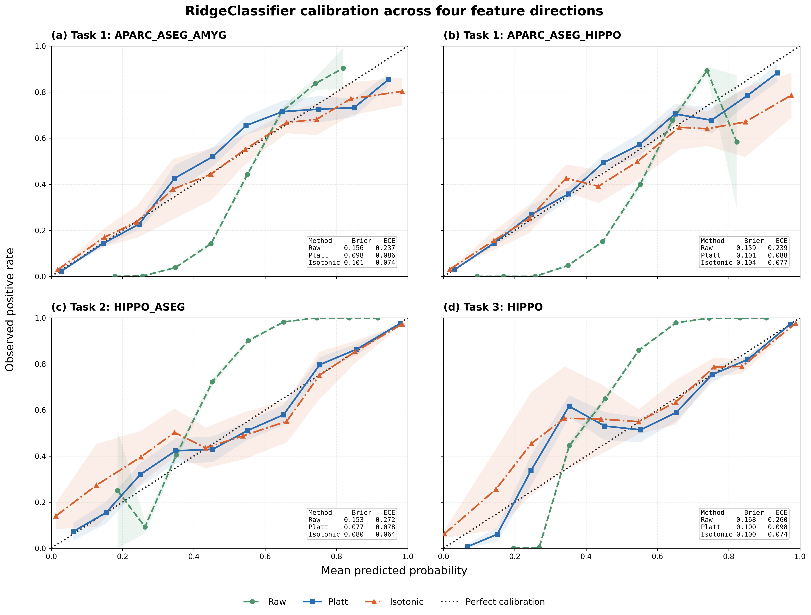

七個資料方向呈現一致的平均趨勢：

- **Platt scaling**：所有方向皆取得最低平均 Brier score
- **Isotonic regression**：所有方向皆取得最低平均 ECE

在 52 組「任務 × 方向 × 模型」設定中：

- Platt scaling 在 **38 組**取得最低 Brier score
- Isotonic regression 在 **52 組**皆取得最低 ECE

Isotonic 的非參數分段映射能明顯降低 ECE，但也可能壓縮部分樣本排序，使 AUC 略有下降；Platt 則能改善機率品質，同時較完整保留原始排序能力。

因此後續主要閾值分析以 **Platt scaling** 為基礎。

---

## 10. Phase 3：決策閾值與操作點

固定 0.5 閾值在三項任務產生不同的 Sensitivity / Specificity 配置。

以純臨床方向為例：

| 任務 | 0.5 BalAcc | Youden BalAcc | 0.5 Sens / Spec | Youden Sens / Spec |
|---|---:|---:|---|---|
| Task 1 | 0.770 | **0.832** | 0.611 / 0.929 | 0.841 / 0.823 |
| Task 2 | 0.727 | **0.824** | 0.954 / 0.500 | 0.794 / 0.854 |
| Task 3 | 0.719 | **0.787** | 0.941 / 0.496 | 0.780 / 0.795 |

Task 1 的適合閾值明顯低於 0.5；Task 2 與 Task 3 則較高。

另外比較：

- **Youden**：平衡 Sensitivity 與 Specificity
- **Sens@0.90**：優先維持高檢出率
- **Spec@0.90**：優先降低健康者誤判

### 結果觀察

AUC 反映模型排序能力，但實際二元分類行為仍高度受到 decision threshold 影響。

因此：

> **固定 0.5 並不是所有分類任務都適合的決策基準。**

同一模型可依不同應用需求調整操作點，而不需要重新訓練模型。

---

## 11. Phase 4：Ensemble Learning

集成分析比較三種權重方式：

- Equal weighting
- Performance weighting
- Convex Super Learner (convexSL)

並分為：

1. **方向內集成**：同一資料方向中的不同模型
2. **跨方向集成**：不同資料方向的預測輸出

方向內集成的 ΔBalAcc 約介於 **-0.0077 至 +0.0031**，部分組合出現小幅改善。

跨方向六種主要組合則沒有超越各自最佳單一方向，ΔBalAcc 約介於 **-0.0054 至 -0.0002**。

### 結果觀察

集成並非單純「模型越多越好」。

當成員模型學到的訊號高度相似、預測誤差相關性高時，即使增加更多模型，也不一定能取得實質互補。

這部分除了比較最佳分數，也提供了對 ensemble diversity 與模型互補性的實驗觀察。

---

# 完整臨床基準下的影像增量與多模態融合

## 12. Clin33 / FS_topK / Clin33_FS_topK

前期的 clin_fs 會將臨床與影像特徵共同排序，因此後續重新建立一套完整臨床基準分析：

- **Clin33**：完整 33 個正式臨床特徵
- **FS_topK**：397 個 FreeSurfer 特徵中獨立排序後選取 Top-K
- **Clin33_FS_topK**：完整臨床 + Top-K 影像（early fusion）
- **NN_fusion**：臨床與影像雙分支中期融合
- **Late fusion**：不同資料方向的 OOF 預測於輸出層整合

影像 Top-K 由五種代表模型的純影像 AUC 綜合比較後固定為：

- Task 1：Top-30
- Task 2：Top-30
- Task 3：Top-40

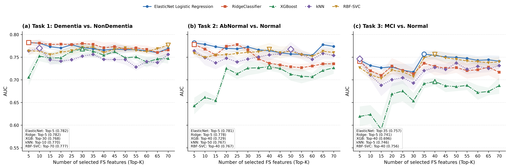

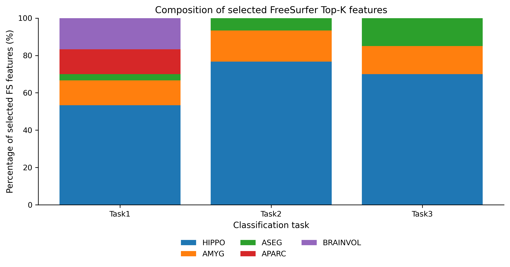

高排名 FreeSurfer 特徵仍主要集中在：

- 海馬
- 杏仁核
- 皮質下結構
- 部分皮質區域

與前期方向篩選及特徵排序觀察到的影像訊號一致。

---

## 13. Early Fusion 與 Intermediate Fusion

| 任務 | 設定 | 代表模型 | BalAcc | AUC |
|---|---|---|---:|---:|
| Task 1 | Clin33 | RidgeClassifier | **0.843** | 0.922 |
|  | FS_top30 | GaussianNB | 0.705 | 0.772 |
|  | Clin33_FS_top30 | TabPFN | 0.842 | **0.929** |
|  | NN_fusion | NN_fusion | 0.806 | 0.909 |
| Task 2 | Clin33 | RidgeClassifier | **0.844** | **0.928** |
|  | FS_top30 | GaussianNB | 0.711 | 0.782 |
|  | Clin33_FS_top30 | ElasticNet Logistic | 0.834 | 0.926 |
|  | NN_fusion | NN_fusion | 0.774 | 0.888 |
| Task 3 | Clin33 | ExtraTrees | **0.803** | **0.898** |
|  | FS_top40 | ElasticNet Logistic | 0.691 | 0.746 |
|  | Clin33_FS_top40 | TabPFN | 0.802 | **0.898** |
|  | NN_fusion | NN_fusion | 0.748 | 0.852 |

純影像方向具有獨立分類能力，但整體低於完整 Clin33。

Early fusion 能維持接近 Clin33 的表現：

- Task 1 取得更高 AUC
- Task 2 / Task 3 接近完整臨床基準

Intermediate fusion 的 NN_fusion 則在三項任務都沒有超越 Clin33 或 early fusion。

### NN_fusion 架構

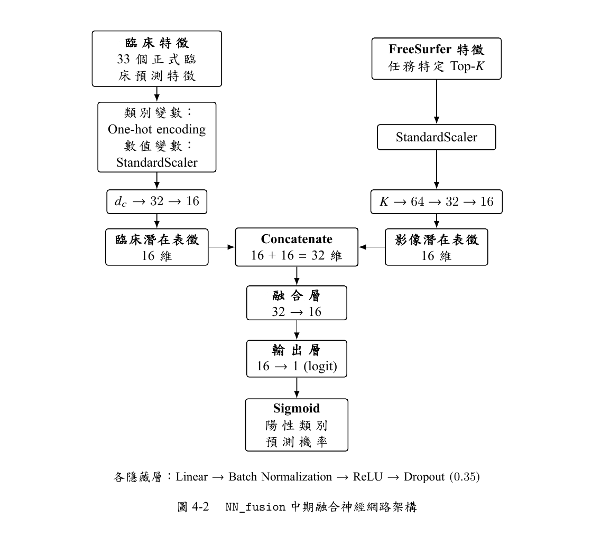

臨床與影像分支各自建立 16 維潛在表徵，再進行 concatenation 與最終分類。

這項比較顯示，在目前樣本規模與以 FreeSurfer 區域統計量為主的表格式資料中，增加神經網路融合複雜度未必能自動轉化為更好的分類能力。

---

## 14. 影像增量結果

為進一步區分「影像本身具有分類訊號」與「影像能否增加完整臨床模型的預測能力」，使用相同 12 個模型逐一比較：

`Clin33_FS_topK − Clin33`

三項任務共形成 36 項 AUC 增量比較。

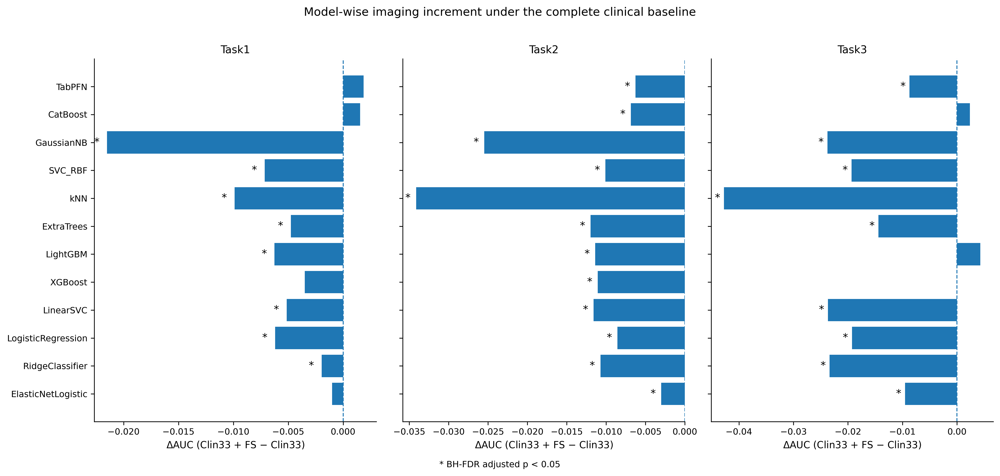

| 任務 | 比較 | q<0.05 且 ΔAUC>0 | q<0.05 且 ΔAUC<0 | 平均 ΔAUC |
|---|---|---:|---:|---:|
| Task 1 | Clin33_FS_top30 vs. Clin33 | **0** | 8 | -0.0053 |
| Task 2 | Clin33_FS_top30 vs. Clin33 | **0** | 12 | -0.0126 |
| Task 3 | Clin33_FS_top40 vs. Clin33 | **0** | 9 | -0.0148 |

在目前資料與分析設定下，影像加入完整 Clin33 後沒有形成跨模型一致的正向 AUC 增量。

這並不代表影像沒有資訊。

純影像特徵本身能辨識不同認知狀態，高排名特徵也集中於海馬、杏仁核與相關皮質／皮質下區域；差異在於完整臨床資料已包含高度直接的認知與功能訊號，因此額外影像資訊在預測層面的提升空間較有限。

因此可以將兩種資訊理解為不同角色：

- **Clinical features**：目前資料中較直接且穩定的預測來源
- **FreeSurfer features**：提供獨立分類訊號與神經解剖層面的補充資訊

這也是整套影像增量分析的重要目的：將**獨立判別能力**與**完整臨床基準之外的增量預測價值**分開評估。

---

## 15. Early / Intermediate / Late Fusion 比較

各格為 `BalAcc / AUC`：

| 任務 | Clin33 | FS_topK | Early fusion | Intermediate fusion | Late fusion |
|---|---|---|---|---|---|
| Task 1 | **0.843 / 0.922** | 0.705 / 0.772 | 0.842 / **0.929** | 0.806 / 0.909 | 0.842 / 0.922 |
| Task 2 | **0.844 / 0.928** | 0.711 / 0.782 | 0.834 / 0.926 | 0.774 / 0.888 | 0.836 / 0.923 |
| Task 3 | 0.803 / **0.898** | 0.691 / 0.746 | 0.802 / **0.898** | 0.748 / 0.852 | **0.805** / 0.895 |

三種融合方式呈現不同特性：

### Early fusion
直接串接臨床與影像特徵，整體最能維持較高的排序能力；Task 1 的 AUC 達 **0.929**。

### Intermediate fusion
使用 NN_fusion 分別建立兩個模態的 latent representation，再於中間層整合。三項任務整體低於 early / late fusion。

### Late fusion
先分別建模，再於預測輸出層進行整合。部分任務在特定操作點可取得小幅 Balanced Accuracy 改善，例如 Task 3 由 0.803 提升至 0.805。

整體而言，early fusion 與 late fusion 各自在不同指標與任務上呈現局部優勢，而 intermediate fusion 在目前資料條件下較沒有展現優勢。

<details>
<summary><strong>展開：convexSL 晚期融合方向權重</strong></summary>

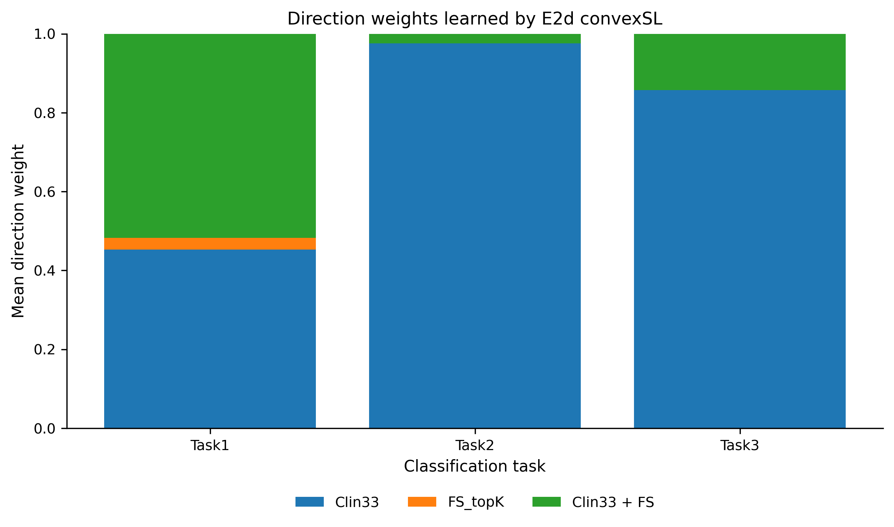

</details>

---

## 16. 固定超參數敏感度分析

為確認主要觀察是否高度依賴每一外層折的超參數搜尋結果，另建立固定參數版本。

對每組「任務 × 資料方向 × 模型」，彙整 100 個外層折中最常出現的最佳參數，形成固定設定並重新執行主要流程。

結果顯示：

- AUC 等排序能力整體與逐折調參版本接近
- Balanced Accuracy、Sensitivity、Specificity 等閾值相關指標波動稍大
- 主要模型相對表現大致維持
- 影像增量方向沒有根本改變
- 最佳 late-fusion 設定大致穩定

因此主要分析觀察並非只由單一超參數搜尋方式所造成。

---

# 主要研究貢獻與觀察

這項專案的價值不只在建立一個失智症分類器，而是將從影像特徵建立到最終決策的多個分析環節放入同一套評估框架中，系統性比較不同方法對結果造成的影響。

### 1. 建立完整的多階段分類分析框架

整合：

**FreeSurfer 特徵萃取 → 49 個影像方向篩選 → 多模型比較 → ANOVA 特徵排序 → Top-N / Top-K 選擇 → eTIV 校正 → Probability Calibration → Threshold Optimization → Ensemble Learning → Early / Intermediate / Late Fusion → Hyperparameter Sensitivity Analysis**

因此能從特徵、模型、機率、決策與融合等不同層次觀察模型行為，而不是只比較單一 classifier 的最高分數。

### 2. 比較三種不同認知狀態分類情境

Dementia、AbNormal 與 MCI 三項任務呈現不同的分類難度、影像結構與模型行為。

尤其 MCI vs. Normal 的整體分類難度較高，也顯示早期認知變化的訊號比 Dementia 與 NonDementia 的差異更細微。

### 3. 找到具有神經解剖意義的影像訊號

FreeSurfer 特徵即使單獨使用仍具有認知狀態辨識能力，高排名特徵多集中於：

- 海馬與海馬亞區
- 杏仁核
- 皮質下結構
- 楔前葉與部分顳葉皮質區域

使模型結果除了預測效能，也具備一定程度的神經解剖可解釋性。

### 4. 觀察不同建模方法的明顯特性差異

結果並非由單一模型全面主導：

- ElasticNet Logistic Regression、RidgeClassifier 等線性模型較常維持穩定的分類平衡
- TabPFN 多具有較高 AUC 與較佳 Brier score
- calibration 方法在 Brier、ECE 與排序能力上各有不同效果
- threshold adjustment 可大幅改變 Sensitivity / Specificity，而不影響 AUC
- ensemble 與 multimodal fusion 的效益則與成員互補性及融合位置有關

這些結果說明「最佳方法」取決於實際評估目標，而不是只存在單一最佳模型。

### 5. 區分影像的「判別能力」與「增量價值」

FreeSurfer 影像本身具有分類能力，並帶有神經解剖資訊；但在完整 Clin33 已存在時，額外 AUC 增益有限。

這項分析將兩個經常被混在一起的問題分開：

- 影像是否具有疾病相關訊號
- 影像是否能在完整臨床資訊之外進一步改善預測

結果顯示兩者並不等價，也使臨床與影像資訊在模型中的角色更清楚。

### 6. 多項方法學比較提供額外觀察

除了主要分類結果，也觀察到：

- eTIV 與多數腦體積特徵顯著相關，但校正後未必提升預測效能
- 增加特徵數量沒有持續改善分類結果
- 固定 0.5 threshold 不適合所有任務
- 更複雜的模型或 multimodal fusion 不保證更高效能
- 部分 ensemble 可接近最佳單一模型，但真正提升仍取決於模型之間是否具有互補性

因此專案提供的不只是最終模型分數，也包含多種分析選擇在實際資料上的比較結果與決策依據。

---

## 研究限制與後續方向

目前結果仍受資料規模與研究設計限制，後續可從下列方向延伸：

- **外部驗證與樣本擴充**：以不同醫院或獨立 cohort 驗證模型與特徵穩定性
- **更多影像表徵**：納入原始 MRI、surface-based representation 或其他 MRI modality
- **體積校正方法**：比較比例校正、非線性或多變量 eTIV correction
- **多模態建模**：探索 attention-based 或其他 representation learning 方法
- **完整 nested feature selection**：將更多研究層級選擇納入外層交叉驗證，以進一步評估端到端泛化能力

此外，20 個 random seeds 均為同一批受試者的重複資料切分，因此 Wilcoxon 與 BH-FDR 主要用於描述不同切分下差異方向的一致性，而非視為 20 組獨立受試者樣本的母體統計推論。

---

## Repository Structure

```text
freesurfer-dementia-classification/
│
├── README.md
├── .gitignore
│
├── figures/
│   ├── 01_research_workflow.png
│   ├── 02_nn_fusion_architecture.png
│   ├── 03_baseline_task1.png
│   ├── 04_baseline_task2.png
│   ├── 05_baseline_task3.png
│   ├── 06_topn_balanced_accuracy.png
│   ├── 07_probability_calibration.png
│   ├── 08_fs_topk_auc.png
│   ├── 09_fs_topk_group_composition.png
│   ├── 10_imaging_increment_delta_auc.png
│   ├── 11_topn_auc_appendix.png
│   └── 12_convexsl_direction_weights.png
│
├── tables/
│   └── 01_...csv ~ 16_...csv
│
└── docs/
    └── master_thesis.pdf
```

`figures/` 收錄 README 中使用的主要分析流程與結果圖；`tables/` 則保存由最終論文整理的主要彙整結果。

README 著重於研究流程、方法比較與主要觀察；完整模型設定、逐模型結果、統計檢定與附錄內容可參閱正式論文。

---

## Data Availability

臨床資料與 3D T1 MRI 涉及人體研究資料及資料使用限制，因此 repository 不公開：

- 受試者層級臨床原始資料
- MRI / DICOM 影像
- FreeSurfer 個體輸出
- 個體層級預測
- 中間分析資料

公開內容僅包含彙整後統計結果、研究圖表、分析流程與完整論文。

---

## 使用工具與環境

- **Neuroimaging**：FreeSurfer 7.4.1 (`recon-all -all`, `segmentHA_T1.sh`)
- **FreeSurfer environment**：Ubuntu 22.04.5 LTS
- **Machine Learning / Statistics**：Logistic / ElasticNet / Ridge / SVM、RandomForest / ExtraTrees、XGBoost、LightGBM、CatBoost、kNN、Gaussian Naive Bayes、TabPFN
- **Multimodal Modeling**：Early fusion、NN_fusion intermediate fusion、late fusion、convex Super Learner
- **Evaluation**：Repeated / nested stratified cross-validation、OOF prediction、ANOVA F-score、probability calibration、threshold optimization、ensemble learning、Wilcoxon signed-rank test、BH-FDR
- **Documentation**：LaTeX

---

## 完整論文

完整研究方法、逐模型結果、統計檢定、附錄與參考文獻請見：

**[Master's Thesis PDF](docs/master_thesis.pdf)**

論文題目：  
**基於 FreeSurfer 腦結構量化特徵與臨床資料之失智症分類研究：特徵篩選、多模型比較與集成學習**

National Sun Yat-sen University  
Department of Applied Mathematics  
2026
